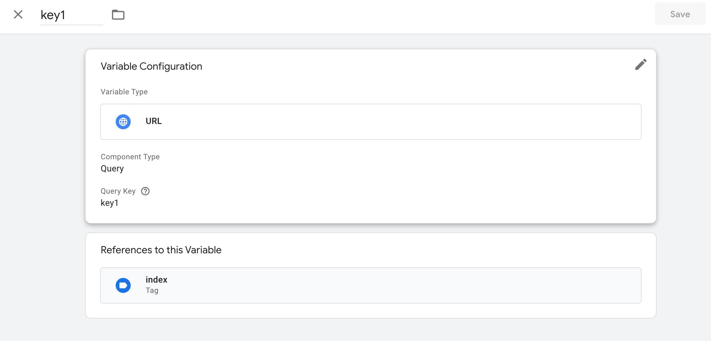
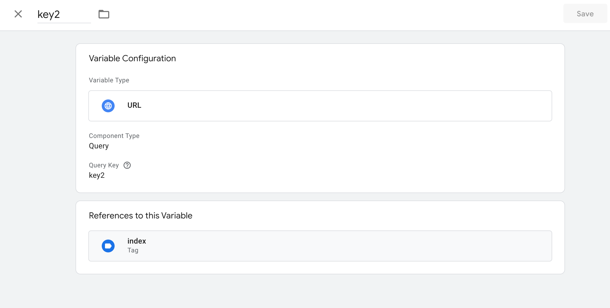
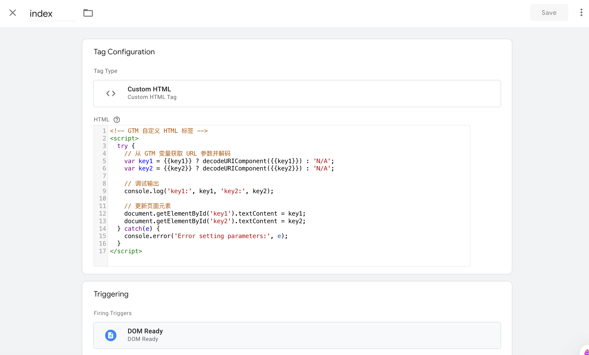
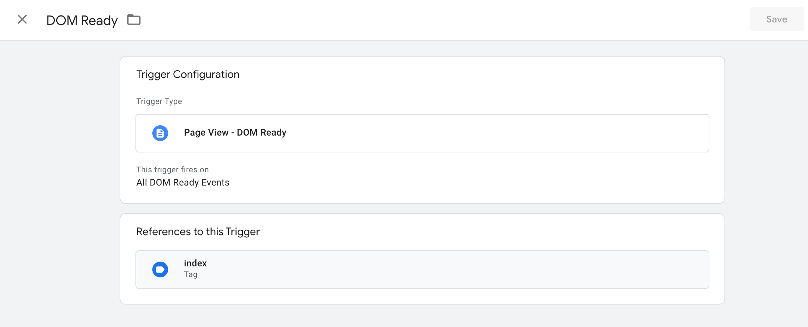
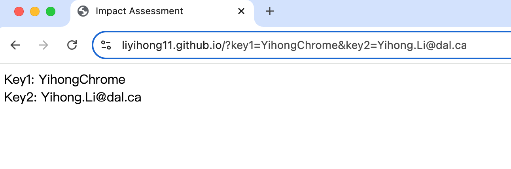
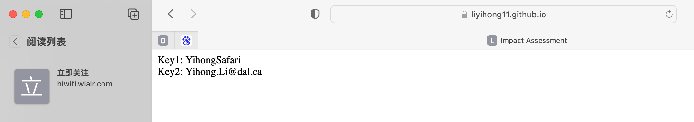

Impact.com Assesment A1 作业提交
​1. 项目概述
​目标：提取 URL 中的查询参数（key1 和 key2），并在页面上显示这些值。
​测试 URL：https://liyihong11.github.io/?key1=Yihong&key2=Yihong.Li@dal.ca

​2. GitHub 页面链接
​GitHub 仓库地址：[点击访问仓库](https://github.com/liyihong11/liyihong11.github.io)

​3. Google Tag Manager 配置截图
​3.1 变量配置
​变量名称：key1

​截图：

​变量名称：key2

​截图：

​3.2 标签配置
​标签名称：index
​截图：

​3.3 触发器配置
​触发器名称：Dom Ready
​截图：

​4. 测试结果
​4.1 Chrome 浏览器测试
​测试 URL：https://liyihong11.github.io/?key1=YihongChrome&key2=Yihong.Li@dal.ca
​结果：
页面显示：Key1: YihongChrome, Key2: Yihong.Li@dal.ca
​截图：

​4.2 Safari 浏览器测试
​测试 URL：https://liyihong11.github.io/?key1=YihongSafari&key2=Yihong.Li@dal.ca
​结果：
页面显示：Key1: YihongSafari, Key2: Yihong.Li@dal.ca
​截图：

