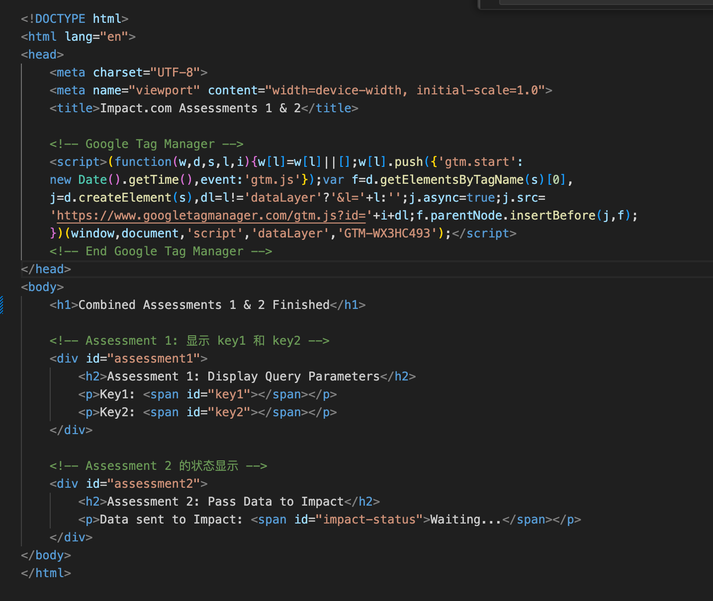
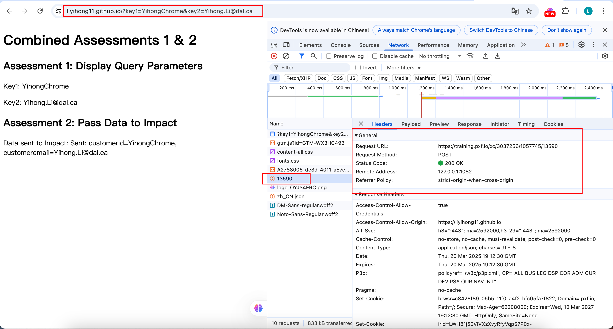

# Yihong Li Impact.com 评估作业 A1 & A2 提交文档

## 1. GitHub 页面链接 & GitHub Page 页面链接 
**仓库地址**：  
[点击访问 GitHub 仓库](https://github.com/liyihong11/liyihong11.github.io)    

**网页地址**：  
[点击访问 GitHub Page 页面](https://liyihong11.github.io/)    

---

## 2. 项目概述
**目标1**：A1 提取 URL 中的查询参数（`key1` 和 `key2`），并在页面上显示这些值  
**目标2**：A2 提取 URL 中的查询参数（`key1` 和 `key2`），通过Google Tag Manager将这两个数据作为customerid和customeremail传入Impact  

**测试 URL**：  
`https://liyihong11.github.io/?key1=Yihong&key2=Yihong.Li@dal.ca`

**静态网页源码Assessment1**：  

**静态网页源码Assessment2**：  

---

## 3. Google Tag Manager 配置

### 3.0 Tag Manager Live Version Overview

### 3.1 变量配置
- ​**变量名称**：`key1`  
    

- ​**变量名称**：`key2`  
    

### 3.2 Tags配置  
- ​**Assessment1 Tag名称**：`index`  
    

- ​**Assessment2 Tag名称**：`Assesment2`  
      

### 3.3 Triggers配置
- ​**Triggers**：`Dom Ready`  
    

---

## 4. 测试结果

### 4.1 Chrome 浏览器测试
**测试 URL**：  
`https://liyihong11.github.io/?key1=YihongChrome&key2=Yihong.Li@dal.ca`

**结果**：  
页面显示：  
`Key1: YihongChrome, Key2: Yihong.Li@dal.ca`

**截图**：  

### 4.2 Safari 浏览器测试
**测试 URL**：  
`https://liyihong11.github.io/?key1=YihongSafari&key2=Yihong.Li@dal.ca`

**结果**：  
页面显示：  
`Key1: YihongSafari, Key2: Yihong.Li@dal.ca`

**截图**：  

---
